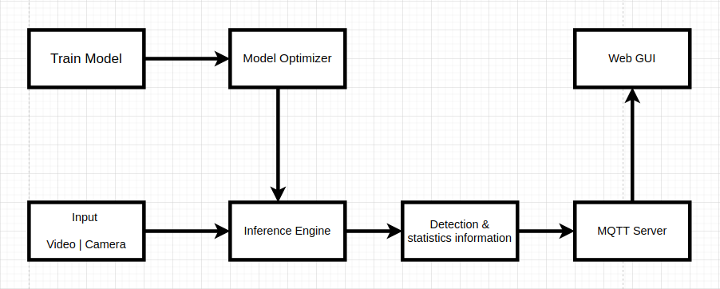
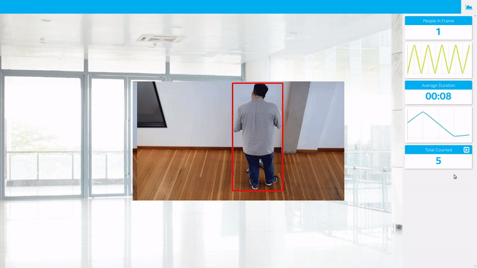

= OpenVino For People Counter
:idprefix:
:idseparator: -
:sectanchors:
:sectlinks:
:sectnumlevels: 6
:sectnums:
:toc: macro
:toclevels: 6
:toc-title: Table of Contents

toc::[]

== Introduction

The people counter application will demonstrate how to create a smart video IoT solution using Intel® hardware and software tools. The app will detect people in a designated area, providing the number of people in the frame, the average duration of people in the frame, and total count.

People counting applications can be used in a *retail store*, *supermarket*, *shopping malls*, *metro station*, *airport*. For example, Once a person is detected, We can follow the object through a shopping pipeline in a retail setting or track and collate behavior i.e customer traffic patterns and time spent at merchandising location.

== Architecture Block Diagram

== Prerequisites

To run the application in this tutorial, the OpenVINO™ toolkit and its dependencies must already be installed and verified using the included demos. Installation instructions may be found at: https://software.intel.com/en-us/articles/OpenVINO-Install-Linux or https://github.com/udacity/nd131-openvino-fundamentals-project-starter/blob/master/linux-setup.md

The below steps are tested on Ubuntu 16.04:

[source,bash]
----
# Install OpenVino
wget http://registrationcenter-download.intel.com/akdlm/irc_nas/16057/l_openvino_toolkit_p_2019.3.376.tgz
tar -xvf l_openvino_toolkit_p_2019.3.376.tgz
cd l_openvino_toolkit_p_2019.3.376 
sed -i 's/decline/accept/g' silent.cfg
sudo ./install.sh -s silent.cfg

# Install Nodejs and its dependencies
curl -sSL https://deb.nodesource.com/gpgkey/nodesource.gpg.key | sudo apt-key add -
VERSION=node_6.x
DISTRO="$(lsb_release -s -c)"
echo "deb https://deb.nodesource.com/$VERSION $DISTRO main" | sudo tee /etc/apt/sources.list.d/nodesource.list
echo "deb-src https://deb.nodesource.com/$VERSION $DISTRO main" | sudo tee -a /etc/apt/sources.list.d/nodesource.list
sudo apt-get update
sudo apt-get install nodejs

# System dep
sudo apt update
sudo apt-get install python3-pip
pip3 install numpy
pip3 install paho-mqtt
sudo apt install libzmq3-dev libkrb5-dev
sudo apt install ffmpeg
sudo apt-get install cmake

# Create a virtual env
python3.5 -m venv openvino_p3
source openvino_p3/bin/activate
pip3 install dlib paho-mqtt fysom imutils

# Project dep
# To-do: Create a requirements.txt for project specfic
pip3 install 
----

== Build

**1.** Clone the repository at desired location:

[source,bash]
----
https://github.com/nullbyte91/openvino-people_counter_IoT_app
----

**2.** Configure the build environment for the OpenCV
toolkit by sourcing the "setupvars.sh" script.

[source,bash]
----
source /opt/intel/openvino/bin/setupvars.sh -pyver 3.5
----

**3.** Change to the top git repository:

[source,bash]
----
cd openvino-people_counter_IoT_app
----

**4.** Install web server dep:
[source,bash]
----
# For MQTT/Mosca server:
cd webservice/server
npm install

# For Web server:
cd ../ui
npm install

----
**5.** Model conversion (IR using model optimizer)
[source,bash]
----
#Install MO Dep
pip3 install -r /opt/intel/openvino/deployment_tools/model_optimizer/requirements_tf.txt
----

[quote]
If you are using caffe object detection model use requirements_caffe.txt, requirements_onnx.txt for onnx.

Based on initial experimental work, I decided to use SSD based object detection. Let try ssd_mobilenet_v2_coco and ssdlite_mobilenet_v2_coco.
[source,bash]
----
# Downlaod ssd model from Tensorflow model zoo
# ssd_mobilenet_v2_coco
wget http://download.tensorflow.org/models/object_detection/ssd_mobilenet_v2_coco_2018_03_29.tar.gz

tar -xvf ssd_mobilenet_v2_coco_2018_03_29.tar.gz

mkdir ssd_mo_model

python3 /opt/intel/openvino/deployment_tools/model_optimizer/mo_tf.py --input_model ssd_mobilenet_v2_coco_2018_03_29/frozen_inference_graph.pb --tensorflow_use_custom_operations_config  /opt/intel/openvino/deployment_tools/model_optimizer/extensions/front/tf/ssd_v2_support.json --tensorflow_object_detection_api_pipeline_config ssd_mobilenet_v2_coco_2018_03_29/pipeline.config --reverse_input_channels -o ssd_mo_model
----

[quote] 
We can use --data_type to get quantized weights {'FP16', 'FP32', 'half', 'float'}

[source,bash]
----
# ssdlite_mobilenet_v2_coco
http://download.tensorflow.org/models/object_detection/ssdlite_mobilenet_v2_coco_2018_05_09.tar.gz

tar -xvf ssdlite_mobilenet_v2_coco_2018_05_09.tar.gz

mkdir ssdlite_mo_model

python3 /opt/intel/openvino/deployment_tools/model_optimizer/mo_tf.py --input_model ssdlite_mobilenet_v2_coco_2018_05_09/frozen_inference_graph.pb --tensorflow_use_custom_operations_config  /opt/intel/openvino/deployment_tools/model_optimizer/extensions/front/tf/ssd_v2_support.json --tensorflow_object_detection_api_pipeline_config ssd_mobilenet_v2_coco_2018_03_29/pipeline.config --data_type FP16 -o ssd_mo_model/FP16

----
Precision benchmark:

.Table Title
|===
|Model |FP32 |FP16 

|ssd_mobilenet_v2
|65M
|33M

|ssdlite_mobilenet_v2
|18M
|8.6M
|===

== Usage

=== Run

==== Detection, Count and duration
**1.** Output on OpenCV window:
[source,bash]
----
python3 main.py -m ssd_mo_model/FP32/frozen_inference_graph.xml -i resources/Pedestrian_Detect_2_1_1.mp4 -l /opt/intel/openvino/deployment_tools/inference_engine/lib/intel64/libcpu_extension_sse4.so
----

**2.** Output on Web Server:

Terminal 1: *Start the Mosca server*
[source,bash]
----
cd webservice/server/node-server
node ./server.js

# You should see the following message, if successful:
Mosca server started.
----

Terminal 2: *Start webserver GUI*
[source,bash]
----
cd webservice/ui
npm run dev

# You should see the following message in the terminal.
webpack: Compiled successfully
----

Terminal 3: *FFmpeg Server*
[source,bash]
----
sudo ffserver -f ./ffmpeg/server.conf
----

Terminal 4: *Run a application*

[source,bash]
----
source /opt/intel/openvino/bin/setupvars.sh -pyver 3.5
python3 main.py -m ../openvino-people_counter_IoT_app/ssdlite_mo_model/FP16/frozen_inference_graph.xml -i resources/Pedestrian_Detect_2_1_1.mp4 -l /opt/intel/openvino/deployment_tools/inference_engine/lib/intel64/libcpu_extension_sse4.so -d CPU -pt 0.6 -o WEB | ffmpeg -v warning -f rawvideo -pixel_format bgr24 -video_size 768x432 -framerate 24 -i - http://0.0.0.0:3004/fac.ffm
----

=== Performance analysis
*Detection, Count and duration*

Hardware configuration: i7-6820HQ CPU
|===
|Model |FP32 - Size |FP32 - FPS | FP16 - Size | FP16 - FPS 

|ssd_mobilenet_v2_coco_2018_03_29
|65M
|7.61 
|33M
|8.01
|ssdlite_mobilenet_v2
|18M
|11.02
|8.6M
|13.06
|===

=== Bonus
*Detection with high FPS using async with multithreading*
[source,bash]
----
cd detection

python3 main.py -i ../resources/Pedestrian_Detect_2_1_1.mp4 -m ../openvino-people_counter_IoT_app/ssdlite_mo_model/FP16/frozen_inference_graph.xml -l /opt/intel/openvino/deployment_tools/inference_engine/lib/intel64/libcpu_extension_sse4.so -pt 0.5
----

This implementation gives *90 FPS* on the same hardware.

== To Do

=== README

* [x] docker compose for deployment
* [x] Performance analysis

=== Development

* [x] Try with different models
* [x] Kalman filter based tracking
* [x] dlib based tracking
* [x] Fix labels issue
* [x] supermarket use cases
* [x] async with multithread implementation

